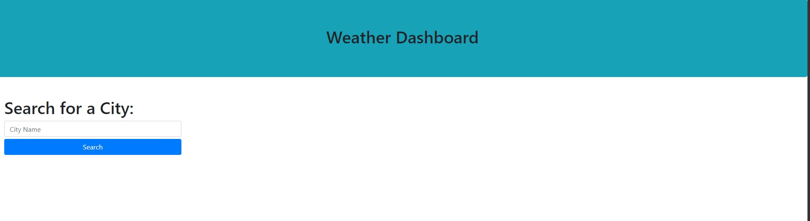
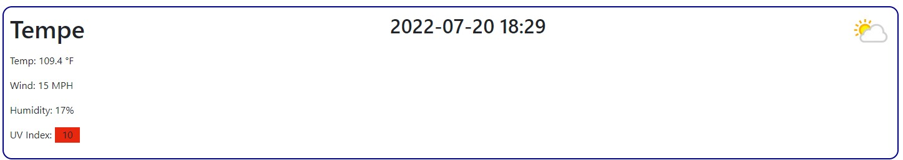
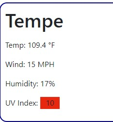
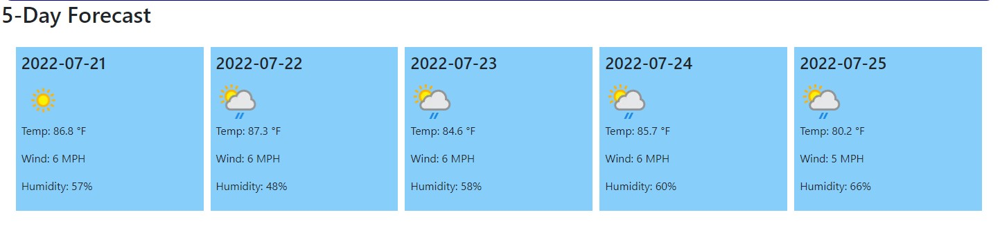
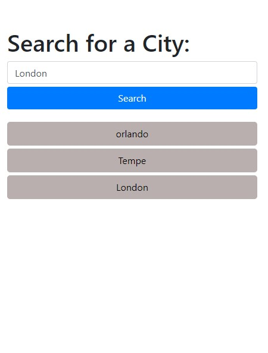
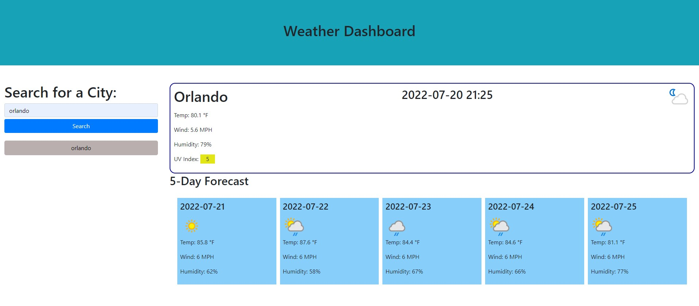

# Weather Dashboard 

# Purpose

Weather Dashboard is an application that allowed users to check current weather and 5 days forecast in advanced.

- Search field allows users to search weather by input the city name.

- The application will show the current status of the date and time, weather, and an icon of weather condition. 

- The weather condition includes defferent color uv index. Color of uv index indicates whether the conditions are favorable (green), moderate (yellow), and server (red).

- The app also displays 5-day forecast, include date, temp, wind, humidity and an icon of weather condition. 

- The application keeps the search history which allows users to go back and click on the city in the history.

- The application outlook

# Build with:
- HTML
- CSS 
- Javascript
- Bootstrap \
- 3rd party API api.weatherapi.com

# Deployment

To deploy this application go to: https://moniquemeas.github.io/Weather-Dashboard/

# Contribute
Monique Meas

